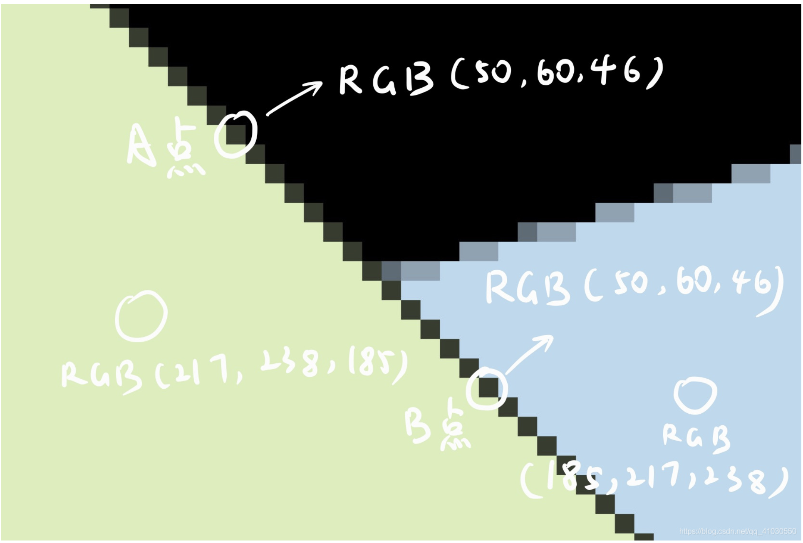
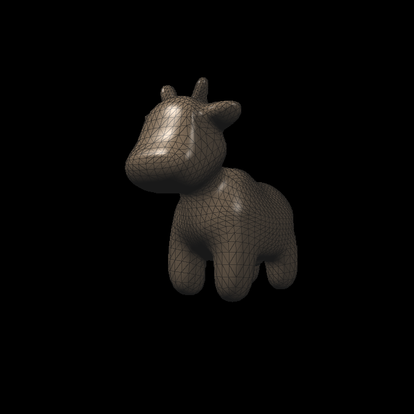

# GAMES 101

## Homework 2

MSAA is not correct.

It did not correctly handle the edge between the green triangle and blue triangle. And there is a black line on the edge.

(image thanks to [GAMES101 BBS](http://games-cn.org/forums/topic/%e3%80%90%e6%80%bb%e7%bb%93%e3%80%91msaa%e4%b8%ad%e9%bb%91%e7%ba%bf%e9%97%ae%e9%a2%98%e7%9a%84%e5%87%ba%e7%8e%b0%e5%8e%9f%e5%9b%a0%e4%bb%a5%e5%8f%8a%e8%a7%a3%e5%86%b3%e6%96%b9%e6%a1%88/ ))

The reason is the insufficient precision of z-Buffers. We indeed multi-sampling 4 sub-pixel of each pixel, but we only maintain one z-buffer information. If we firstly render green triangle and secondly render blue triangle, we will find that the blue triangle will not be rendered on the edge because the z-value is deeper than the green. And the black edge is left because the edge of the green triangle is multi-sampled with green and black(background).

So what we have to do is maintain bigger z-Buffers to make multi-sampling more precise. However, I think to maintain a bigger z-Buffers is SSAA. The right way is to solve the problem of detecting an edge of MSAA.

## Homework 3

Render without MSAA due to reason above.

If we ignore the edge, the wrong MSAA making rendering ridiculous as all edge are sampling with black background but not neighbor triangle.

